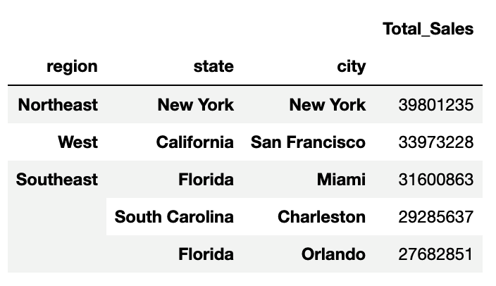
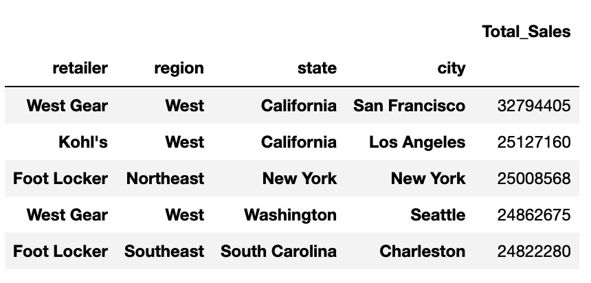
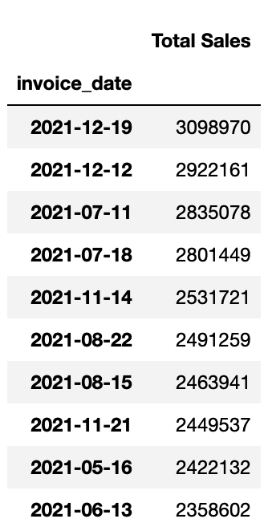

# athletic_sales_analysis
## Background
You'll analyze sales data to gain insights into which cities in the U.S. have sold the most athletic wear over two years. Next, you'll determine which retailers had the greatest total sales for athletic wear, and which retailers sold the most women's athletic footwear. Finally, you'll determine which day and week had the highest sales for women's athletic footwear.

## Before You Begin
Before starting the assignment, be sure to complete the following steps:

Create a new repository for this project called athletic_sales_analysis. Do not add this homework assignment to an existing repository.

Clone the new repository to your computer.

Push these changes to GitHub or GitLab.

## Challenge Instructions
The starter code provided includes all the steps necessary to complete this challenge.

## Combine and Clean the Data
- Import the two CSV files, athletic_sales_2020.csv and athletic_sales_2021.csv, and read them into DataFrames.

- Check that the columns in the two DataFrames have similar names and data types.

- Combine the two DataFrames by the rows using an inner join, and reset the index.

    ## HINT
    - After combining the DataFrames, do the following:

    - Check if there are any null values.

    - Check each column’s data type.

    - Convert the "invoice_date" column to a datetime data type.

    - Confirm that the data type has been changed.

## Determine which Region Sold the Most Products
- Use either the groupby or pivot_table function to create a multi-index DataFrame with the "region", "state", and "city" columns.

- Rename the aggregated column to reflect the aggregation of the data in the column.

- Sort the results in descending order to show the top five regions, including the state and city that have the greatest number of products sold. Your final table should look like the following image:

- The top five regions with their states and cities that have the greatest number of products sold.

## Determine which Region had the Most Sales
- Use either the groupby or pivot_table function to create a multi-index DataFrame with the "region", "state", and "city" columns.

- Rename the aggregated column to reflect the aggregation of the data in the column.

- Sort the results in descending order to show the top five regions, including the state and city that generated the most sales. Your final table should look like the following image:

- The top five regions with their states and cities that generated the most sales.

## Determine which Retailer had the Most Sales
- Use either the groupby or pivot_table function to create a multi-index DataFrame with the "retailer", "region", "state", and "city" columns.

- Rename the aggregated column to reflect the aggregation of the data in the column.

- Sort the results in descending order to show the top five retailers along with their region, state, and city that generated the most sales. Your final table should look like the following image:

- The top five retailers along with their region, state, and city that have the greatest average price for the products ordered.

## Determine which Retailer Sold the Most Women's Athletic Footwear
- Filter the combined DataFrame to create a DataFrame with only women's athletic footwear sales data.

    ## HINT
    - Use either the groupby or pivot_table function to create a multi-index DataFrame with the "retailer", "region", "state", and "city" columns.

    - Rename the aggregated column to reflect the aggregation of the data in the column.

    - Sort the results in descending order to show the top five retailers along with their region, state, and city that sold the most women's athletic footwear. Your final table should look like the following image:
    

    - The top five retailers along with their region, state, and city that sold the most women's athletic footwear.

## Determine the Day with the Most Women's Athletic Footwear Sales
- Create a pivot table with the "invoice_date" column as the index and the "total_sales" column as the values parameter.

- Rename the aggregated column to reflect the aggregation of the data in the column.

- Apply the resample function to the pivot table, place the data into daily bins, and get the total sales for each day.

- Sort the resampled DataFrame in descending order to show the top 10 days that generated the most women's athletic footwear sales. Your final table should look like the following image:

- The top 10 days that generated the most women's athletic footwear sales.

## Determine the Week with the Most Women's Athletic Footwear Sales
- Apply resample to the pivot table above, place the data into weekly bins, and get the total sales for each week.

- Sort the resampled DataFrame in descending order to show the top 10 weeks that generated the most women's athletic footwear sales. Your final table should look like the following image:

- The top 10 weeks that generated the most women's athletic footwear sales.

## Hints and Considerations
- Consider what you've learned so far. You’ve learned how to combine data using concatenation, joins, and merging, and how to reshape data using groupby, pivot, pivot_table, resample, and melt functions.

- If you're struggling with how to start, look back on some of the activities you did in class.

- Always commit your work and back it up with pushes to GitHub or GitLab. You don't want to lose hours of your hard work! Also make sure that your repo has a detailed README.md file.

## Requirements
- Combine and Clean the Data (15 points)
The two DataFrames have been combined on the rows using an inner join and the index has been reset. (10 points)

- The "invoice_date" column has been converted to a datetime data type. (5 points)

- Determine which Region Sold the Most Products (15 points)
- A groupby or pivot_table function has been used to create a multi-index DataFrame with the "region", "state", and "city" columns. (10 points)

- The aggregated column has been renamed to reflect the aggregation of the data in the column. (1 point)

- The results are sorted in descending order to show the top five regions, including the state and city that sold the most products. (4 points)

- Determine which Region had the Most Sales (15 points)
- A groupby or pivot_table function has been used to create a multi-index DataFrame with the "region", "state", and "city" columns. (10 points)

- The aggregated column has been renamed to reflect the aggregation of the data in the column. (1 point)

- The results are sorted in descending order to show the top five regions, including the state and city that generated the most sales. (4 points)

- Determine which Retailer had the Most Sales (15 points)
- A groupby or pivot_table function has been used to create a multi-index DataFrame with the "retailer", "region", "state", and "city" columns. (10 points)

- The aggregated column has been renamed to reflect the aggregation of the data in the column. (1 point)

- The results are sorted in descending order to show the top five retailers along with their region, state, and city that generated the most sales. (4 points)

- Determine which Retailer Sold the Most Women's Athletic Footwear (20 points)
- A filtered DataFrame is created that shows only women's athletic footwear sales data. (8 points)

- A groupby or pivot_table function has been used to create a multi-index DataFrame with the "retailer", "region", "state", and "city" columns. (7 points)

- The aggregated column has been renamed to reflect the aggregation of the data in the column. (1 point)

- The results are sorted in descending order to show the top five retailers along with their region, state, and city that had the most women's athletic footwear sales. (4 points)

- Determine the Day with the Most Women's Athletic Footwear Sales (15 points)
- A pivot table is created that has the "invoice_date" column as the index and the "total_sales" column assigned to the values parameter. (10 points)

- The aggregated column has been renamed to reflect the aggregation of the data in the column. (1 point)

- The resample function is used on the pivot table, the data is placed into daily bins, and the total sales for each day is calculated. (2 points)

- The results are sorted in descending order to show the days that generated the most women's athletic footwear sales. (2 points)

- Determine the Week with the Most Women's Athletic Footwear Sales (5 points)
- The resample function is used on the pivot table, the data is placed into weekly bins, and the total sales for each week is calculated. (3 points)

- The results are sorted in descending order to show the weeks that generated the most women's athletic footwear sales. (2 points)
